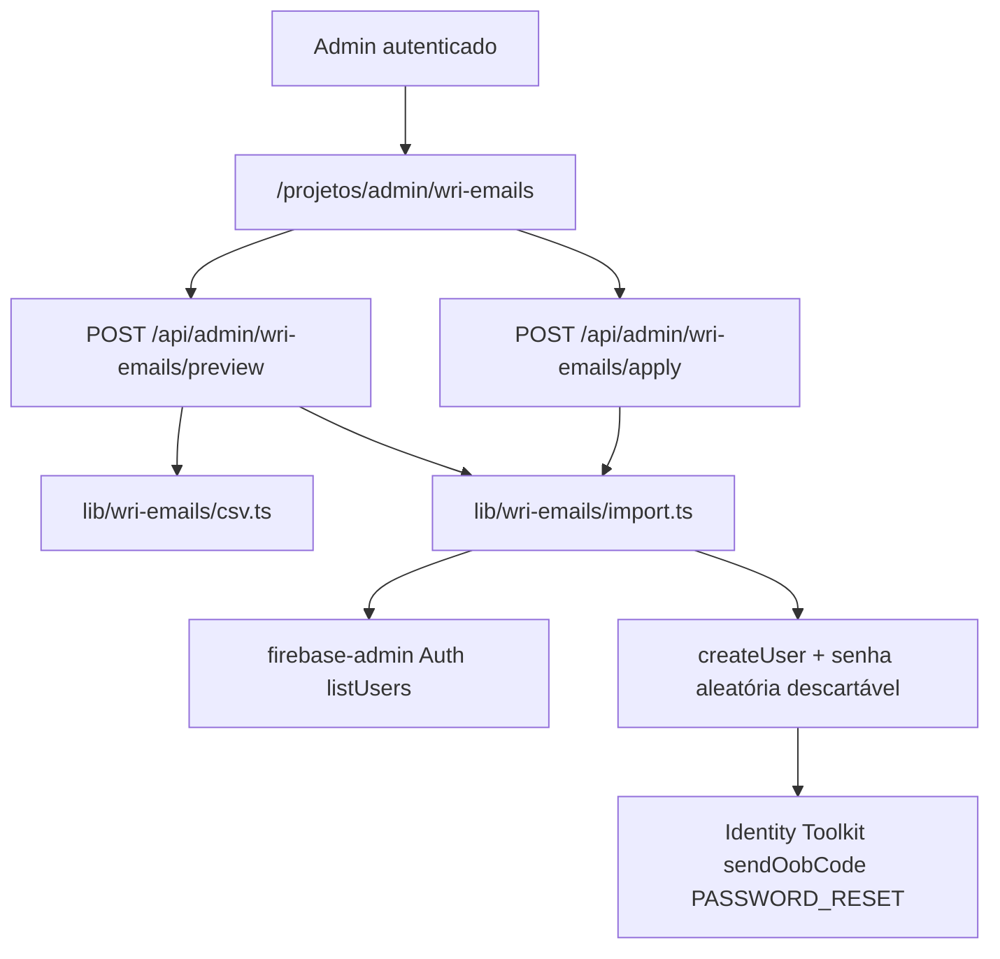
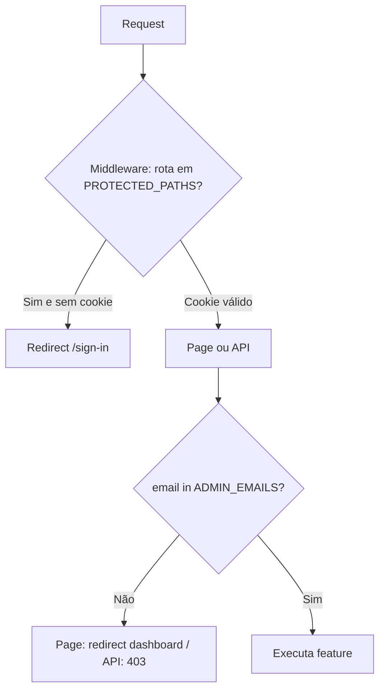

# Admin — Importação de e-mails WRI via CSV

Documentação técnica para manutenção da feature de **upload de lista de e-mails** do dashboard QualiÔnibus / WRI Brasil. Complementa [`AUTENTICACAO.md`](./AUTENTICACAO.md) (operacional) e [`AUTENTICACAO_TECNICA.md`](./AUTENTICACAO_TECNICA.md) (auth geral).

---

## Problema que resolve

Antes, o acesso ao dashboard WRI (`/projetos/dashboard-wri-brasil`) era provisionado **manualmente** no Firebase Console (criar usuário + senha temporária + compartilhar fora da banda). A WRI envia a lista em CSV (`nome`, `e_mail`).

A feature permite que **admins do portal** façam upload desse CSV na UI, validem o diff contra o Firebase Auth e criem **somente** contas novas — cada uma recebe e-mail de redefinição de senha do Firebase.

Não há allowlist na aplicação para usuários comuns: **acesso ao dashboard = existir como usuário email/senha no Firebase Auth**.

---

## Escopo e não-objetivos

| Faz | Não faz |
|---|---|
| Preview (dry-run) do CSV na UI | Remover / desativar quem sumiu do CSV |
| Criar usuários novos no Firebase Auth | Alterar senha, nome ou status de quem já existe |
| Enviar e-mail de reset para cada novo | UI para gerenciar a lista de admins |
| Restringir a tela/APIs a `ADMIN_EMAILS` | Roles/Firestore/custom claims |

Operação é **idempotente e aditiva**: rodar o mesmo CSV duas vezes na segunda vez mostra `new: 0`.

---

## Arquitetura



### Camadas

1. **UI** — `src/app/projetos/(projetos)/admin/wri-emails/`
   - `page.tsx` (Server): exige sessão + e-mail em `ADMIN_EMAILS`; senão redirect.
   - `wri-emails-admin.tsx` (Client): upload, validar, confirmar importação, tabelas de relatório.
2. **APIs** (Node runtime, `runtime = "nodejs"`) — `src/app/api/admin/`
   - `GET /api/admin/me` — `{ isAdmin, email }` para o `UserBar` mostrar o link.
   - `POST /api/admin/wri-emails/preview` — valida CSV + diff; **não cria** usuários.
   - `POST /api/admin/wri-emails/apply` — revalida e cria novos + dispara reset.
3. **Domínio** — `src/lib/wri-emails/`
   - `csv.ts` — parse, limites, classificação (invalid / duplicate / unique).
   - `import.ts` — preview e apply contra Firebase Auth.
   - `require-admin.ts` — guard de API + leitura do body CSV.
4. **Infra auth admin**
   - `src/lib/admin.ts` — parse de `ADMIN_EMAILS`.
   - `src/lib/firebase-admin.ts` — singleton Admin SDK (Service Account).

### Fluxo de autorização (duas barreiras)



- **Autenticação** (qualquer usuário Firebase): middleware em [`src/proxy.ts`](../src/proxy.ts) — `PROTECTED_PATHS` inclui `/projetos/admin`.
- **Autorização admin**: checagem server-side com `isAdminEmail()` na page e em todas as rotas `/api/admin/*`. O link no menu **não** é a barreira de segurança (é só UX); a barreira real é o servidor.

---

## Modelo de dados (CSV)

Cabeçalho obrigatório (aliases aceitos para e-mail: `e_mail`, `email`, `e-mail`):

```csv
nome,e_mail
Nome Completo,pessoa@org.br
```

Classificação por linha:

| Classe | Critério | Ação no apply |
|---|---|---|
| `invalid` | vazio, formato inválido, `;` / espaços (ex.: dois e-mails na célula) | Ignora |
| `duplicate_in_csv` | e-mail repetido no arquivo | Mantém a primeira; demais ignoradas |
| `existing` | e-mail já no Firebase Auth | Ignora (não altera) |
| `new` | válido e ausente no Auth | `createUser` + e-mail de reset |

### Limites da aplicação

| Limite | Valor | Motivo |
|---|---|---|
| Tamanho do CSV | 1 MB (`MAX_CSV_BYTES`) | Evitar abuse / OOM em request |
| Linhas de dados | 500 (`MAX_CSV_ROWS`) | Operação previsível + cota de e-mail |
| Delay entre creates | ~400 ms | Suavizar carga / envio de e-mails |
| E-mails de reset (Firebase Spark) | **150 / dia** | Cota da plataforma Google |

Se a lista tiver mais de ~150 **novos** em um dia, a importação parcial pode falhar nos resets após a cota — o relatório de `failed` na UI mostra erros por e-mail. Nesse caso, dividir o CSV ou concluir no dia seguinte (reupload: existentes serão pulados).

---

## Segurança

### O que protege a feature

1. **Sessão Firebase + cookie httpOnly** — mesmas garantias de [`AUTENTICACAO_TECNICA.md`](./AUTENTICACAO_TECNICA.md). Sem login válido, a rota admin redireciona para `/sign-in`.
2. **Allowlist `ADMIN_EMAILS`** — só e-mails listados no env (server-side) acessam page/APIs. Comparação case-insensitive.
3. **Service Account só no servidor** — `FIREBASE_PRIVATE_KEY` / `FIREBASE_CLIENT_EMAIL` nunca vão ao browser. `createUser` e `listUsers` só nas Route Handlers Node.
4. **Sem sync destrutivo** — CSV não apaga contas; reduz risco operacional de um upload errado remover acessos.
5. **Senha aleatória descartável** — o usuário nunca recebe a senha gerada no `createUser`; o fluxo oficial é o e-mail de reset do Firebase.
6. **Preview obrigatório na UX** — o admin vê o diff antes de confirmar; o apply revalida o CSV no servidor (não confia só no estado do client).

### O que *não* é um controle de acesso

- Esconder o link no `UserBar` — cosmética; a URL direta ainda passa pela page + API.
- Validação de CSV no client — apenas UX; a fonte da verdade é o servidor.

### Riscos operacionais conscientes

| Risco | Mitigação / nota |
|---|---|
| Admin dispara centenas de e-mails de reset | Dialog de confirmação + cota Spark + delay |
| Conta admin comprometida | Tratar `ADMIN_EMAILS` + senhas dos admins com cuidado; revogar no Firebase Auth |
| E-mail inválido na lista WRI | Preview lista `invalid`; corrigir CSV e reenviar |
| Lista de admins errada em prod | Atualizar Secret/env e reiniciar o deploy |

### Adicionar ou remover admin

Não há UI. Editar env / Secret do Kubernetes:

```env
ADMIN_EMAILS=lucastavarestt@gmail.com,viniciusoike@gmail.com,viniciusor@datascience.insper.edu.br
```

O e-mail **precisa existir** no Firebase Auth (mesma conta usada no `/sign-in`). Depois reiniciar o app para carregar o novo valor.

---

## Variáveis de ambiente

| Variável | Obrigatória | Uso nesta feature |
|---|---|---|
| `ADMIN_EMAILS` | Sim | Allowlist de admins |
| `FIREBASE_PROJECT_ID` | Sim | Admin SDK |
| `FIREBASE_CLIENT_EMAIL` | Sim | Admin SDK |
| `FIREBASE_PRIVATE_KEY` | Sim | Admin SDK |
| `NEXT_PUBLIC_FIREBASE_API_KEY` | Sim | Envio do e-mail de reset via Identity Toolkit |
| `WRI_PASSWORD_RESET_CONTINUE_URL` / `NEXT_PUBLIC_SITE_URL` | Não | Continue URL opcional no e-mail de reset |

---

## Mapa de arquivos

| Arquivo | Responsabilidade |
|---|---|
| `src/app/projetos/(projetos)/admin/wri-emails/page.tsx` | Gate server-side + shell da página |
| `src/app/projetos/(projetos)/admin/wri-emails/wri-emails-admin.tsx` | UI de upload / preview / apply |
| `src/app/api/admin/me/route.ts` | Flag `isAdmin` para o menu |
| `src/app/api/admin/wri-emails/preview/route.ts` | Dry-run |
| `src/app/api/admin/wri-emails/apply/route.ts` | Persistência + reset |
| `src/lib/admin.ts` | `getAdminEmails` / `isAdminEmail` |
| `src/lib/firebase-admin.ts` | Singleton Admin SDK |
| `src/lib/wri-emails/csv.ts` | Parse e validação |
| `src/lib/wri-emails/import.ts` | Preview / apply |
| `src/lib/wri-emails/require-admin.ts` | Authz das APIs + body CSV |
| `src/components/user-bar.tsx` | Link “Gerenciar e-mails WRI” se admin |
| `src/proxy.ts` | `/projetos/admin` em `PROTECTED_PATHS` |

Dependência runtime: `firebase-admin` (em `dependencies`).

---

## Manutenção — cenários comuns

### Preview ok, apply com falhas parciais

Olhar `failed[]` na resposta / UI. Causas típicas: e-mail já criado entre preview e apply (race), cota de e-mail, formato rejeitado pelo Firebase. Corrigir e reenviar o CSV — existentes serão `existing`.

### Admin logado não vê o link

1. Conferir se o e-mail da sessão está exatamente em `ADMIN_EMAILS` (typo / domínio).
2. Confirmar que o processo Node carregou o env (restart após mudar `.env`).
3. Chamar `GET /api/admin/me` autenticado e inspecionar `{ isAdmin, email }`.

### Usuário novo não recebe e-mail de reset

1. Spam / filtro corporativo.
2. Template de Password reset no Firebase (idioma PT-BR).
3. Cota Spark 150/dia esgotada.
4. O usuário pode usar “Esqueci a senha” em `/sign-in` se a conta já foi criada.

### Preciso revogar acesso de alguém

Não use o CSV. No Firebase Console → Authentication → Users → Disable ou Delete. (Revogação via CSV está fora de escopo de propósito.)

### Evoluções futuras possíveis

- Firestore / custom claims se a lista de admins crescer e precisar de gestão sem deploy.
- Sync “disable missing” se o cliente pedir revogação por CSV (exigiria confirmação forte e auditoria).
- Fila / job assíncrono se listas > 500 forem frequentes.

---

## Testes manuais sugeridos

1. Admin em `ADMIN_EMAILS` → vê link → acessa `/projetos/admin/wri-emails`.
2. Usuário WRI autenticado fora da lista → redirect ao dashboard; `POST` nas APIs → 403.
3. Upload de CSV conhecido → preview bate com contagens esperadas (novos / existentes / inválidos).
4. Apply com 1 e-mail de teste → conta no Console + e-mail de reset + login no dashboard.
5. Reupload do mesmo arquivo → `new: 0`.
