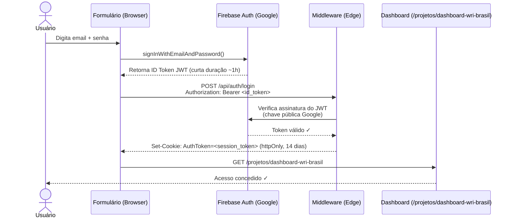
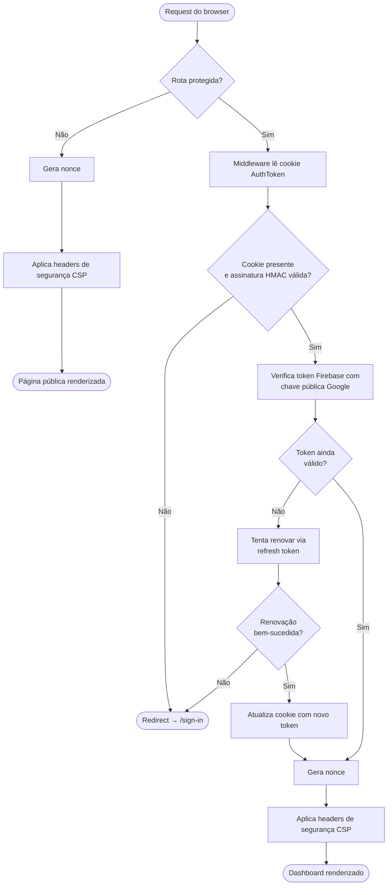
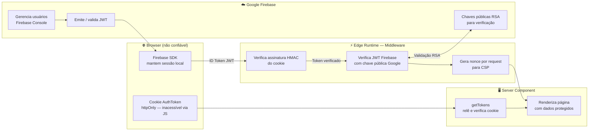

# Documentação Técnica — Autenticação Firebase

## Visão geral

A autenticação é baseada em **Firebase Authentication** combinado com **next-firebase-auth-edge**, que permite verificar tokens JWT do Firebase no Edge Runtime do Next.js (middleware). O acesso à rota protegida é controlado exclusivamente por um cookie de sessão assinado com HMAC, gerado e verificado pelo servidor — nunca pelo cliente.

---

## Fluxo de login



---

## Fluxo de verificação em cada request



---

## Fluxo de logout

```mermaid
sequenceDiagram
    actor U as Usuário
    participant UB as UserBar (Browser)
    participant FB as Firebase Auth (Google)
    participant MW as Middleware (Edge)

    U->>UB: Clica em "Sair"
    UB->>FB: signOut() — encerra sessão local Firebase
    UB->>MW: POST /api/auth/logout
    MW-->>UB: Set-Cookie: AuthToken=; Max-Age=0 (apaga o cookie)
    UB->>UB: window.location.href = "/sign-in"
```

---

## Esqueci a senha e trocar senha

Ambos os fluxos usam apenas o **plano Spark** (sem cartão / Blaze). O e-mail de reset é enviado pelo Firebase (cota: 150/dia). A troca de senha logada não envia e-mail.

| Fluxo | API Firebase | Onde na UI |
|---|---|---|
| Esqueci a senha | `sendPasswordResetEmail` | `/sign-in` → link “Esqueci a senha” |
| Concluir reset | Página padrão do Firebase (`*/__/auth/action`) | Link do e-mail |
| Trocar senha | `reauthenticateWithCredential` + `updatePassword` | `UserBar` → “Trocar senha” |

- A mensagem pós-envio de reset é **genérica** (não revela se o e-mail existe).
- `updatePassword` exige reautenticação com a senha atual (`requires-recent-login`).
- O cookie de sessão (`AuthToken`) **não precisa** ser regenerado após a troca de senha.
- O `url` em `sendPasswordResetEmail` é só a continue URL (`/sign-in`) após o reset na página do Google.

---

## Arquitetura de segurança



---

## Por que é seguro?

### 1. Cookie `httpOnly` — proteção contra XSS

O cookie de sessão (`AuthToken`) é definido com a flag `httpOnly`. Isso significa que **nenhum JavaScript rodando no browser consegue lê-lo** — nem scripts maliciosos injetados via XSS. O único que pode enviar o cookie é o próprio browser, automaticamente, em cada request HTTP.

```
Set-Cookie: AuthToken=<valor>; Path=/; HttpOnly; Secure; SameSite=Lax; Max-Age=1209600
```

### 2. Assinatura HMAC — proteção contra cookies forjados

O cookie não é apenas um token opaco — ele é **assinado com HMAC** usando `AUTH_COOKIE_SIGNATURE_KEY_CURRENT`. Qualquer tentativa de forjar ou modificar o cookie resulta em falha de verificação antes mesmo de consultar o Firebase.

```
Cookie legítimo:  <payload>.<assinatura_hmac_válida>   ✓
Cookie forjado:   <payload_alterado>.<assinatura_inválida>  ✗ → bloqueado
```

### 3. JWT de curta duração — rotação automática

O ID Token do Firebase tem **validade de 1 hora**. O middleware renova automaticamente o cookie ao detectar um token expirado, desde que o refresh token (longa duração) ainda seja válido. Revogar acesso no Firebase Console invalida o refresh token imediatamente.

### 4. Verificação com chave pública do Google

O token JWT é assinado pelo Firebase com chaves RSA privadas do Google. O middleware verifica a assinatura usando as **chaves públicas do Google** (obtidas em `https://www.googleapis.com/robot/v1/metadata/x509/...`). É impossível forjar um token sem a chave privada do Google.

### 5. CSP com nonce por request — proteção contra injeção de scripts

A cada request, o middleware gera um UUID único (nonce) e o inclui:
- No header `Content-Security-Policy` como `'nonce-<valor>'`
- Nos request headers como `x-nonce` (Next.js aplica automaticamente em seus scripts)

Scripts sem esse nonce são bloqueados pelo browser, mesmo que injetados via XSS.

### 6. `SameSite=Lax` — proteção contra CSRF

O cookie tem `SameSite=Lax`, que impede que sites externos acionem requests autenticados em nome do usuário (ataques CSRF). O cookie só é enviado em navegações de mesmo site ou navegações top-level.

### 7. `Secure` em produção — somente HTTPS

Em produção (`NODE_ENV=production`), o cookie só é enviado em conexões HTTPS, impedindo interceptação por rede.

---

## Variáveis de ambiente

| Variável | Tipo | Origem | Descrição |
|---|---|---|---|
| `NEXT_PUBLIC_FIREBASE_API_KEY` | Pública | Firebase Console → Project Settings → App | Chave da API do Firebase para o cliente |
| `NEXT_PUBLIC_FIREBASE_AUTH_DOMAIN` | Pública | Firebase Console → Project Settings → App | Domínio de autenticação (`<id>.firebaseapp.com`) |
| `NEXT_PUBLIC_FIREBASE_PROJECT_ID` | Pública | Firebase Console → Project Settings → App | ID do projeto Firebase |
| `FIREBASE_PROJECT_ID` | **Privada** | Service Account JSON → `project_id` | ID do projeto (uso no servidor) |
| `FIREBASE_CLIENT_EMAIL` | **Privada** | Service Account JSON → `client_email` | Email da Service Account |
| `FIREBASE_PRIVATE_KEY` | **Privada** | Service Account JSON → `private_key` | Chave RSA privada da Service Account |
| `AUTH_COOKIE_SIGNATURE_KEY_CURRENT` | **Privada** | `openssl rand -base64 32` | Chave HMAC ativa para assinar o cookie de sessão |
| `AUTH_COOKIE_SIGNATURE_KEY_PREVIOUS` | **Privada** | `openssl rand -base64 32` | Chave HMAC anterior (rotação sem quebrar sessões ativas) |

> **Variáveis `NEXT_PUBLIC_*`** são expostas ao browser — isso é intencional e seguro. Elas identificam o projeto Firebase publicamente, mas não concedem nenhum acesso administrativo. O acesso real é protegido pelas chaves privadas da Service Account, que nunca chegam ao cliente.

---

## Arquivos relevantes no projeto

| Arquivo | Função |
|---|---|
| `src/proxy.ts` | Middleware: verifica cookie, protege rotas, gera nonce e aplica CSP |
| `src/lib/firebase-auth-config.ts` | Configuração centralizada compartilhada entre middleware e server components |
| `src/lib/firebase-client.ts` | Inicializa Firebase Client SDK (singleton no browser) |
| `src/components/login-form.tsx` | Formulário de login: chama Firebase, envia ID Token ao servidor |
| `src/components/user-bar.tsx` | Exibe usuário logado e aciona logout (Firebase + cookie) |
| `src/app/projetos/(projetos)/dashboard-wri-brasil/page.tsx` | Server Component protegido: usa `getTokens()` para verificar sessão |

---

## Rotação de chaves do cookie (operação de manutenção)

Quando for necessário rotacionar as chaves HMAC (ex: suspeita de comprometimento):

```bash
# 1. Gerar nova chave
openssl rand -base64 32
# → nova_chave_aqui

# 2. Atualizar as variáveis (sem derrubar sessões ativas)
AUTH_COOKIE_SIGNATURE_KEY_PREVIOUS=<valor_atual_de_CURRENT>
AUTH_COOKIE_SIGNATURE_KEY_CURRENT=<nova_chave_aqui>

# 3. Reiniciar o servidor / aplicar no Secret do Kubernetes
kubectl rollout restart deployment/observatorio
```

Sessões existentes continuarão funcionando (verificadas pela chave `PREVIOUS`) e novos logins usarão a chave `CURRENT`. Após todos os cookies antigos expirarem (14 dias), a chave `PREVIOUS` pode ser descartada.
